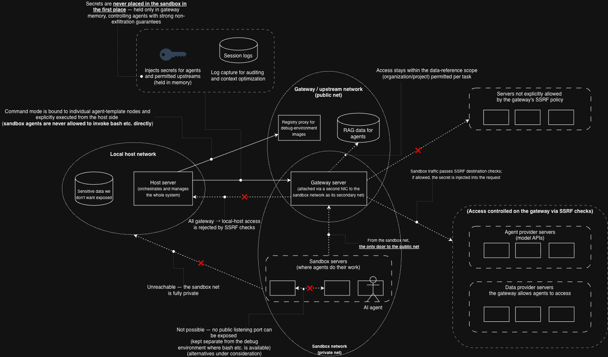

# moeca

Secure multi-agent task management desktop tool. Run multiple agents in parallel from one UI,
review their deliverables from sandbox → host, and keep context/token usage optimized.

Built as a **Tauri + React + TypeScript** desktop app. The UI is a faithful implementation of
the `Orchestra.dc.html` design (imported into `design/` for reference).



The whole design follows from one assumption: **an agent is untrusted code**. So agents run in a
private network that has no route to the host and no route out, and the only thing they can reach
is the gateway — which holds the API keys in its own memory, decides per request whether the
destination is allowed, and records what went through. The red crosses above are the paths that
are closed by construction rather than by policy: sandbox → host, sandbox → the open internet,
gateway → the host's own data. See [`docs/ARCHITECTURE.md`](docs/ARCHITECTURE.md) for the
layer-by-layer rationale.

## Screens

- **Delivery** — per-repo agent deliverables on an `inbox(起票) → working(判断待ち) → done(完了)`
  board. Review drawer with pipeline selector, CI gate (self-review unlocks only after CI passes),
  `差分 / 原本(編集可) / エビデンス` tabs (diff, editable worktree source, VRT/API evidence),
  and an A2A log footer.
- **Daily** — scheduled tasks with a gallery/calendar view; artifacts across video/image/text/voice.
  Plus **pull-model task ingest** from external systems of record (Jira / Trello / Notion): pull
  assigned tickets on demand (through the gateway, so no keys touch the app), and **起票** a ticket
  into a Delivery worktree (branch `ticket/<id>`) to work it through the normal git flow.
- **Terminal** — embedded multi-pane terminals to converse with agents per worktree.
- **Audit** — hierarchical A2A logs (Context/Task/Artifact/Message/Part/Extensions/Metadata)
  with granularity/type/time filters, plus a metrics view (tokens, sessions).
- **Settings** — Prompt & history compression; **RAG** — index explicitly-added local knowledge
  folders (read-only mounted into a dedicated container) and search them, agents retrieving **only via
  the gateway's `/rag` route** (no sandbox→host access). Agent templates (Solo / Static Multi-Agent
  supervisor+graph / Dynamic Orchestration) — **persisted** (localStorage), editable, and **executable**:
  Graph runs as a Stage DAG, Supervisor compiles to `plan→workers→integrate`, Dynamic routes to a
  template at run time. A Solo picks a **provider + model**, opt-in **custom HTTP tools** and **RAG**.
  **Tools** — define gateway-routed HTTP tools (params → `{{substituted}}`). **Proxy / providers** —
  add/edit LLM providers (Anthropic / OpenAI / Gemini and custom): endpoint, models, and **API keys
  (write-only, OS keychain, injected by the gateway — never in localStorage / the container / a
  sandbox)**.
  A Daily schedule can also name a **knowledge scope** — a place in the Knowledge graph:
  **Global**, an organization, or a project. The node is stored and resolved to groups at
  launch, so a group added to that project later is included without re-saving the
  schedule. Global resolves to *no* groups rather than to everything: globally-scoped
  sources are exempt from the group filter by design, so "entitled to nothing" already
  means "only what is everyone's". The resolved groups ride on a gateway **session minted
  for that run** — a sandbox cannot name its own groups, because the gateway states
  `X-Orchestra-Groups` about the caller and discards whatever arrived, so a scope the
  caller claimed would be decoration. The sandbox controller mints it (it holds the raw
  admin token, which no sandbox ever sees) and revokes it when the run ends; a schedule
  with no scope searches everything, as before. **Delivery tasks take the same scope**,
  stored on the task rather than the schedule.

  How far a run may reach *beyond* its scope is a property of the agent template: a Solo
  declares how many **knowledge relations** it may follow out of the scope (0 by default).
  Relations were documentation — "this group requires that one" — so reading them as
  grants is only safe because of that bound; without it a single edge drawn on the canvas
  could connect every group in the graph. Traversal is directed, and `conflicts-with` is
  never followed: an edge whose meaning is "these two disagree" must not also grant. Two
  stages of one run can therefore hold different entitlements, so the controller mints one
  session per distinct group set rather than one per run.
  **Task sources** — add/remove the Daily pull providers (Jira / Trello / Notion);
  persisted host-side and hot-reloaded, adapters route through the gateway (which injects each
  provider's credentials). Sandbox isolation + forbidden-command policy.
- **Workspace** — VSCode-like worktree editor (file tree, syntax highlight, references) opened
  from a Delivery review.

Dark and light themes (toggle in the top nav). All visuals are driven by CSS variables in
[`src/styles/index.css`](src/styles/index.css) — the single reskin surface.

## Develop

```bash
pnpm install
pnpm dev        # Vite dev server at http://localhost:1420
pnpm build      # tsc + production build
```

### Native desktop shell (Tauri)

```bash
./scripts/dev.sh                              # dev: builds sidecars, runs the native window
# native arm64 installer (.app + .dmg), sidecars bundled via externalBin:
rustup target add aarch64-apple-darwin
pnpm tauri build --target aarch64-apple-darwin
```

The `x86_64-apple-darwin` toolchain also works (runs under Rosetta); pass that target instead for
an Intel build.

## Architecture notes

- State: a single Zustand store ([`src/store/useStore.ts`](src/store/useStore.ts)) — theme,
  notifications, delivery board, review drawer.
- Routing: hash routes map 1:1 to the top-nav tabs (+ `/workspace`).
- Screens live under `src/features/<screen>/`; the app frame is `src/components/layout/`.
- **Security model** — how untrusted agents are isolated from the host and internet
  (L3 `--internal` egress island, the dual-homed gateway, L7 allowlist/SSRF-deny/key
  injection, the file-based delegation channel), and how the same chokepoint doubles
  as a complete, tamper-evident **audit** plane, is documented in
  [`docs/ARCHITECTURE.md`](docs/ARCHITECTURE.md).

## Backend — Go sidecars

Spawned by the Tauri shell and torn down on exit (see
[`src-tauri/src/sidecars.rs`](src-tauri/src/sidecars.rs)):

- **[`gateway/`](gateway/)** `:8787` — security-proxy. Single egress for sandboxed agents:
  session auth, upstream allowlist, API-key injection, rate limit, token/cost budget,
  body-size limit, timeout, SSE streaming, structured access logs. Agents never hold keys.
  Access records are captured at this single chokepoint and, when `ORCHESTRA_AUDIT_DIR` is set
  (a host volume in container mode), persisted to an **append-only, hash-chained** SQLite log that
  survives restarts — `GET /_gateway/audit/verify` recomputes the chain and reports the first
  tampered row, so the structural tamper-evidence becomes cryptographic. (Without it, the in-memory
  500-record ring is used.)
  It also enforces **write authorization** per upstream: the `github` service is
  deny-by-default for mutations — only branch-create / PR-create / comments pass, while
  **PR merge, pushes to protected branches (`main`/`master`/`develop`), and direct
  `contents` commits are rejected** (opt back in via `writeAllow` in the config). So even
  with a `GITHUB_TOKEN`, an agent cannot land changes onto a base branch.
  Runs as a **Docker container** — it is the only component that holds keys and reaches the
  internet, and it sits on the internal sandbox network so sandboxes can reach *only* it.
  **Providers are dynamic**: a loopback **admin API** (`/_gateway/providers`, `…/secret`)
  adds/edits providers and injects secrets into gateway memory. Two guardrails make this safe:
  the admin API needs an **admin token** the gateway holds only as a **SHA-256 hash** (the raw
  token lives host-side, in the Tauri shell) and which sandboxes never receive; and an **SSRF
  deny** refuses to forward to loopback / RFC1918 / `host.docker.internal` targets. Secrets are
  never returned by any endpoint (`GET` exposes only `hasSecret`).
- **[`hostagent/`](hostagent/)** `:8788` — git worktrees for agent deliverables → **real**
  structured diffs against the target branch, CI gate, and merge on self-review approval
  (`/task/merge` requires CI passed). The Delivery board's **live** mode reads this. Runs as
  a loopback host process — **not reachable from a strict sandbox** (merge stays a host action).
  State (schedules, pulled Daily tickets, configured task sources) is persisted in an **embedded
  SQLite** database under the app data dir (`ORCHESTRA_DATA_DIR`; pure-Go driver, migrations) so it
  survives restarts. It also hosts the Daily pull endpoints (`/daily/pull`, `/daily/tickets`,
  `/daily/promote`, `/daily/sources`).
- **[`sandbox/`](sandbox/)** `:8789` — Docker sandbox controller. Also hosts the **multi-agent
  orchestrator** (`/run`): a template-agnostic executor for a **Stage DAG** — each stage is one
  hardened sandbox; a stage runs once its `dependsOn` stages succeed, up to `maxParallel` at a time,
  handing work off through the shared worktree. A Graph template (Settings) is compiled client-side
  into such a DAG and run from a live task's review drawer. Runs each agent in a hardened
  container: only its worktree mounted, `--read-only` root, `--cap-drop ALL`,
  `--security-opt no-new-privileges`, no host env. In **strict** isolation (the default) the
  container joins the `--internal` `orchestra-egress` network: **no route to the host or the
  internet — the gateway and the registry proxy are the only things it can reach**. A `relaxed`
  mode (ordinary bridge, for future interactive terminals) is available per request; the
  controller derives the gateway and registry base URLs from the mode server-side, so a client
  cannot downgrade egress or redirect where dependencies come from.
  It also owns the **container-image allowlist** (`/images`): a stage names a *policy*
  (`base` / `poly` / `media`, or a custom one added in Settings), never an image reference —
  the controller supplies the ref, the network posture, the resource caps and the writable
  scratch paths, so the hardening flags are identical for every image. The reference is
  resolved **host-side to an immutable digest** before launch and recorded on the stage, and
  images must be explicitly **promoted** before an unattended (Daily) run may use one.
- **[`registry/`](registry/)** `:8791` — package-registry proxy (container), the dependency-fetch
  counterpart to the gateway. Dual-homed on egress + upstream, so `npm install` / `pip install` /
  `go mod download` work inside a sandbox that has **no route to the internet**. It serves
  **GET/HEAD only** (an agent can fetch packages but can never publish one), to **fixed** upstreams
  with bounded redirects and no credentials, rewrites the absolute download URLs in registry
  metadata back to itself, logs every fetch, and holds the durable artifact cache so disposable
  sandboxes don't re-download their dependency tree. Module checksum verification stays **on**.
- **[`ragindex/`](ragindex/)** `:8790` — RAG indexer (container). Indexes a **read-only** knowledge
  mount into an in-memory embedding store (embeddings fetched **through the
  gateway** — it holds no key) and answers similarity search. It sits on the `orchestra-upstream`
  network (gateway-reachable) but **not** on the sandbox egress network, and publishes only a loopback
  management port — so a sandboxed agent reaches search **only via the gateway's `/rag` route**, never
  this service or the host directly. The knowledge lives only here.
  Beyond text/code it ingests **CSV/TSV** (rendered a row per line, each cell labelled with its
  column header), **PDF** (text layer, page by page, pure Go — a scan with no text layer falls back
  to metadata and says so) and **subtitle tracks** (`.vtt` / `.srt`, cues stripped to speech).
  **Images and video are registered but not read**: their path and filename are embedded so the file
  is findable, and the Source is marked `content: metadata` so the UI can say *パスのみ* rather than
  imply the contents are searchable. A video's spoken content becomes searchable by putting a caption
  track next to it (`demo.mp4` + `demo.ja.vtt`) — which is why no media parser (ffmpeg/libvips) runs
  inside the one container that holds all the knowledge.
  Which folders (and external HTTPS documents) it may read is registered in **Settings → RAG**;
  each local folder is bind-mounted **read-only** into this container and nowhere else. A bind mount
  cannot be added to a running container, so adding or removing one restarts the indexer and
  rebuilds the index — it keeps nothing durable, so that costs a re-index and nothing else.
  (`ORCHESTRA_KNOWLEDGE_DIR` still seeds the list for installs that predate the UI.)

```bash
# each service:  go test ./... && go run . -config config.json
```

### Agent runtime ([`agent/`](agent/))

The program that runs **inside** each sandbox (image `orchestra/agent:latest`). Working dir `/work`
is the mounted worktree. It runs a **tool-use loop** (`read_file` / `write_file` / `edit_file`
/ `list_files`, all scoped to `/work`) through the gateway — so it holds **no API key** (it sets only
`Content-Type`; the gateway injects credentials). The loop is written against a neutral model and a
`Provider` interface speaks **three dialects** — **Anthropic Messages / OpenAI Chat Completions /
Gemini generateContent** — selected per run by `ORCHESTRA_PROVIDER` (+ `ORCHESTRA_BASE_URL` /
`ORCHESTRA_MODEL`), so a Solo agent's chosen provider+model drives which model runs. It authenticates
to the gateway with `ORCHESTRA_SESSION` (scrubbed before the upstream call). Beyond the file tools it
can be given **custom HTTP tools** and a **`rag_search`** tool (via `ORCHESTRA_TOOLS`) — both are calls
**through the gateway**, so the allowlist / SSRF-deny / write-authz / key-injection apply and the agent
still holds no keys.

**Stage handoff is a contract, not a convention.** When a stage finishes, the runner — not the
model — writes a manifest to `.orchestra/stages/<stageId>.json` carrying the agent's closing
message, the files it actually wrote (recorded by the tools, not claimed by the model), and how
the loop ended. The controller tells each stage which stages it builds on (`ORCHESTRA_UPSTREAM`,
derived from the DAG), and the agent folds those manifests into its own prompt. So a dependency
that produced nothing says so in words, instead of surfacing as a `read_file` error on some
filename that a prompt once agreed on. Before this, a supervisor that answered in prose rather
than writing the plan file left every stage exiting 0 and the worktree empty — the closing text
was discarded, and the convention that would have caught it existed only inside a translated
string. See [`agent/internal/handoff`](agent/internal/handoff/).

An agent can also **look at** what a run produced: `view_image` puts an image from
`/work` into the conversation as an image, encoded for whichever dialect the stage is
bound to (Anthropic `image`, OpenAI `image_url` data URI, Gemini `inlineData`). Until
this existed an agent could only be *told* a file was there — an integrator whose job
was to check a generated picture signed off on a filename. It is a separate tool from
`read_file` on purpose: an image stays in the context for every later turn, so looking
should be a decision. The copy of an image that travels to the model is re-encoded first — a generated PNG is
megabytes, and a handful of them put a request past the gateway's body limit and killed a
run mid-way. The artifact on disk is left exactly as produced; only the copy in the
conversation is shrunk, because lossless is the right choice for a file being kept and the
wrong one for a picture being shown to a model that downscales it anyway.

No dialect takes a video, so `view_video` samples still frames instead, spread across
its length — several moments being a better check than one anyway. The extraction runs
in the **media image**, not the agent's: ffmpeg stays confined to the one image built to
hold it, and the agent asks for frames over the same file-based channel delegation uses,
opening no path to the host.

A tool can also **start from a file the run already has**: a parameter may be declared as
a path into `/work`, sent either as a multipart form part or as base64 inside the JSON
body — the two shapes real providers use. That is what makes an edit route (img2img, a
video from a reference frame) a tool definition rather than a patch, and it is why the
shipped `edit_image` preset needs no code of its own. The path is guarded like every
other file argument, because a parameter naming a file is still a path an agent chose.

A provider-side call can also straddle a turn — the call arrives in one response and its
result at the top of the next — and a turn in that state may be answered with tool results
and nothing else. So images a tool read wait for a turn where that is allowed rather than
riding back beside the results, which is a request the provider refuses outright.

Granting **web search** brings provider-side code execution with it — the current
web-search tool filters its own results that way — and that execution lives in a container
the conversation has to keep naming, or the provider refuses to continue a turn that has
work outstanding. The agent carries that id forward. It is not a capability moeca hands
out and not a hole in the sandbox: the container is the provider's, on the provider's
machines, holding only what this conversation had already sent it and with no route back
here.

It can also be granted **artifact tools** — the mechanism image, speech and video
generation are built on. An ordinary gateway-routed HTTP tool answers the model with its
response body; an artifact tool declares where the bytes are (`output.kind` = `binary`, or
`base64` plus a JSON path), and the response never reaches the model at all: it is decoded,
written into `/work`, and the model is told only the path it landed on. That is the only shape
that can work — a generated image is hundreds of kilobytes of base64, past what a tool result
keeps, and `write_file` would write the encoding rather than the bytes. The tool gains a
required `path` argument automatically, and an extension whitelist refuses a "generated file"
that would land as `.sh`. Asynchronous generation (video, everywhere) is a `poll` block:
create, wait on a status field, download. Each is a **separate grant** on the agent template —
they differ by an order of magnitude in cost, and video especially has to be turned on
deliberately. Generation is a model call like any other: routed through the gateway, keys
injected there, recorded in the audit log with its run and stage, and stripped from a
networkless (`media`-policy) stage that could not reach an upstream anyway.

Because the request body, the route and the response binding are all configuration, a provider
that spells its API differently — Imagen's `instances`/`parameters`, a service that returns its
bytes under another key — is a tool definition rather than a patch. The three shipped
generation tools are seeded into Settings → Tools as editable presets. (`ORCHESTRA_MEDIA` is
still accepted and compiles to the same artifact tools, so a schedule whose run spec was
compiled before this keeps running.)

It can also be granted **web search** (via `ORCHESTRA_WEB_SEARCH`), and this one is unlike every
other tool: the agent does **not** run it. `web_search` is an Anthropic **server tool** — the agent
advertises it in the same `tools` array, Anthropic performs the search on its own infrastructure, and
the query and its results arrive as extra content blocks in the same `/v1/messages` response. So the
container never opens a socket to the web, the egress island is unchanged, and the gateway sees the
model call it already sees — no new upstream, no new key, no new allowlist entry. That is why it is
preferred here over wiring a search API up as a custom HTTP tool. It is still a **per-agent grant**
(searches are billed per use, and an agent that was not given the tool answers from what it knows
rather than appearing to have looked) with a **use cap** that defaults to 5. A searching turn can
stop with `pause_turn` — unfinished, not over — which the loop resumes by echoing the turn back
verbatim. It only exists in the Anthropic dialect: the OpenAI and Gemini encoders drop server tools,
and the grant is not compiled onto stages using those providers at all. It emits A2A-style JSON logs. `go test ./... && docker build -t orchestra/agent:latest .`

Three sandbox images ship, all built from [`agent/`](agent/) and selected per stage by policy name:

| Policy | Dockerfile | Contents | Network |
| --- | --- | --- | --- |
| `base` | `Dockerfile` | distroless, agent binary only — no shell, no toolchain | egress |
| `poly` | `Dockerfile.poly` | Node 22 / Python 3 / Go 1.25 + shell, for build/test/debug **command** stages (`stage.cmd`) | egress |
| `media` | `Dockerfile.media` | ffmpeg / ImageMagick / libvips for Daily's video·image artifacts | **none** |

`media` is deliberately *not* part of the common image: media parsers consume untrusted binary
input, so keeping them out of every sandbox avoids widening every agent's attack surface — and as
its own stage it needs no network at all, which makes it more confined than a normal sandbox, not
less. Toolchain caches are `tmpfs` (gone with the container); the durable cache lives in the
registry proxy, where a sandbox can only read it.

Verified end-to-end: the sandbox launched the agent container against a mock Messages API; the agent
ran its loop (`tool_use write_file → end_turn`) and wrote a file into the worktree, with
`ReadonlyRootfs=true`, `CapDrop=[ALL]`, and only the worktree mounted `rw`.

Sidecars are reaped on app quit (`RunEvent::Exit`) **and** self-terminate if the app is `SIGKILL`ed
(a parent-PID watchdog in each service). They're bundled into the shippable app via Tauri
`externalBin` (`pnpm tauri build`).

## Run the full native app

```bash
# Optional bring-your-own seed: on launch the app pushes these into the gateway (via the
# loopback admin API) as the anthropic/github secrets if the keychain has none. You can also
# just enter keys in Settings → Proxy (stored in the OS keychain). Keys never reach agents.
export ANTHROPIC_API_KEY=... GITHUB_TOKEN=...   # optional
./scripts/dev.sh        # builds the sidecars + gateway container image, wires them, runs `tauri dev`
```

The frontend's Delivery board runs on mock data by default; click **mock data → live**
in the board header to connect to the host agent (`configs/hostagent.json` lists your repos)
and see real worktree tasks, diffs, CI, and merges. On a live task, the review drawer's
**エージェント実行** button launches the agent runtime in a Docker sandbox against that worktree
(via the sandbox controller) and streams its A2A logs — the full loop, from the UI.

### Demo data

Delivery, Daily and Audit ship with mock data, so they have something on screen from the first
launch. **Knowledge does not** — it shows what the indexer actually holds, which is nothing until
a folder is registered. [`examples/knowledge/`](examples/knowledge/) is a small fictional corpus
(a payments platform and an inventory service) that exercises every ingestion path: Markdown,
CSV/TSV, a PDF with a real text layer, SVG/PNG images, and a video with a caption track next to it.

```bash
./scripts/seed-demo.py     # registers the corpus, then seeds the graph + assigns sources
```

It runs in two halves because they need different things to be true. Registering the folder only
writes a file, so it works with the app closed — and takes effect on the next launch, since a bind
mount cannot be added to a running container. Seeding the graph (organizations → projects → groups
→ relations) goes through the same HTTP the UI uses, so it needs the app up and the index built.
Run it, restart the app, run it again. Both halves are idempotent, and everything it creates can be
edited or deleted on screen afterwards — none of it is a fixture the app knows about.

The **Knowledge trace** — which nodes a run actually reached — is built from what the gateway
recorded, so it does not exist until some run has retrieved something. Nothing can manufacture it:
a trace is evidence, and evidence has to be earned by a real retrieval. `--trace` fires one:

```bash
./scripts/seed-demo.py --trace      # one RAG-using agent run (a real model call, so it costs)
```

It asks three questions rather than one, because a single query lights a single spot on the graph
and the screen is worth looking at only when some nodes are lit and most are not. When it finishes
it prints the run id; open it from Audit's トレース button, or go to Knowledge with `?run=<id>`.

**Without an embeddings provider** the index cannot build at all, which leaves the one screen that
explains the whole idea unreachable. For that case:

```bash
ORCHESTRA_EMBED_MODE=offline ./scripts/dev.sh
```

Vectors are then computed locally from hashed token counts instead of by a model. Documents that
share vocabulary land near each other, so the graph has real structure and a search returns
something defensible — but it cannot see that 冪等 and *idempotent* mean the same thing, and never
will. It is opt-in from the environment and never a fallback, `/status` reports `embedMode`, and
Settings → RAG says so on screen: an index that quietly stopped using the model would be worse
than one that stayed empty and explained why.

## Architecture

The [diagram at the top](#moeca) shows the trust boundaries; this is the same shape with the
concrete network names and ports:

```
┌─ Tauri (Rust) window ─────────────────────────────────────┐
│  React UI (6 screens)                                      │
│  spawns: hostagent :8788 (host)  sandbox :8789 (host)      │
│          gateway (container) ── published 127.0.0.1:8787   │
└──────────────────────────┬────────────────────────────────┘
                           │ provisions docker networks
      ┌────────────────────┴───────────────────────┐
      │  orchestra-egress (--internal: no host/net) │
      │   ┌───────────┐        ┌──────────────────┐ │      orchestra-upstream
      │   │ sandbox   │──────▶ │  gateway         │ │──────▶ api.anthropic.com
      │   │ (agent)   │  only  │  (keys + authz)  │ │        api.github.com
      │   │           │        └──────────────────┘ │        (keys injected)
      │   │           │        ┌──────────────────┐ │
      │   │           │──────▶ │  registry proxy  │ │──────▶ registry.npmjs.org
      │   └───────────┘  only  │  (GET/HEAD only) │ │        pypi.org · proxy.golang.org
      │                        └──────────────────┘ │
      └─────────────────────────────────────────────┘
  A strict sandbox can reach ONLY those two proxies — not the host, not the internet.
```

For the full layer-by-layer rationale — why this is enforced by L3 routing rather
than a firewall allowlist, how the gateway is dual-homed, and how runtime delegation
stays inside the boundary — see [`docs/ARCHITECTURE.md`](docs/ARCHITECTURE.md).
